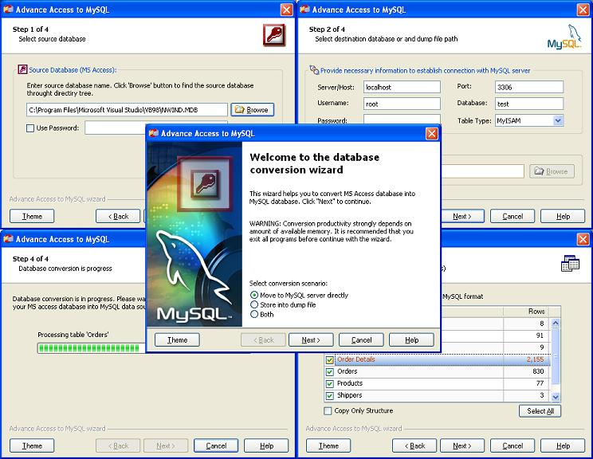



## Advance Access to MySQL

### Description

Here is my first submission on www.pscode.com,

This project prepared to help you to convert your

Ms Access Database into MySQL data source format.

On this project, I'm using some API function to

Draw caption or Picture, so it is helpfull for

newbie in VB to learn about API programming.

I'm using osenxpsuite controls, to

improve my GUI application. if you does not have

osenxpsuite controls, you can download it from:

http://download.osenxpsuite.com/osenxpsuite.zip

I WAS TESTED THIS APP IN MY PC P-III 730 Mhz, and

It work fine. It can convert nwind.mdb to MySQL

data source for 7.07 seconds

If this project usefull for you,

PLEASE VOTE THIS APPLICATION IN www.pscode.com

Note:

- MDAC 2.5 needed

- OsenXPSuite controls (http://download.osenxpsuite.com/osenxpsuite.zip) needed

- MySQL oDBC 3.51 Driver needed

DOES NOT SUPPORT:

• cREATE INDEX

• CREATE PRIMARY KEY

• CREATE FOREIGN KEY

• CONVERT BINARY DATA VALUES (BLOB)

IF ANY IDEA HOW TO SOLVE SOME TROUBLE ABOVE, PLEASE LET ME KNOW.

I REALLY NEED HELP ADVANCE VB DEVELOPER TO SOLVE MY APP

THANK YOU
 
### More Info
 

             |
---                |---
**Submitted On**   |2004-11-01 13:57:04
**By**             |[Ita](https://github.com/Planet-Source-Code/PSCIndex/blob/master/ByAuthor/ita.md)
**Level**          |Intermediate
**User Rating**    |4.9 (49 globes from 10 users)
**Compatibility**  |VB 5\.0, VB 6\.0
**Category**       |[Databases/ Data Access/ DAO/ ADO](https://github.com/Planet-Source-Code/PSCIndex/blob/master/ByCategory/databases-data-access-dao-ado__1-6.md)
**World**          |[Visual Basic](https://github.com/Planet-Source-Code/PSCIndex/blob/master/ByWorld/visual-basic.md)
**Archive File**   |[Advance\_Ac1813281112004\.zip](https://github.com/Planet-Source-Code/ita-advance-access-to-mysql__1-57053/archive/master.zip)

